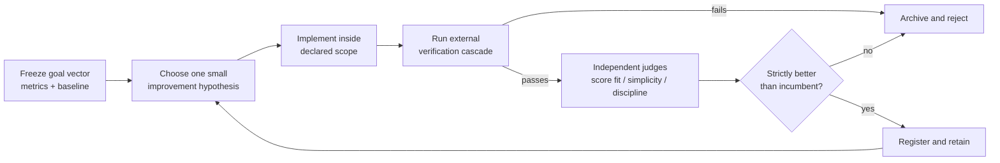

<p align="center"></p>

# ConeCode

**A desktop coding workspace for agents that improve software with evidence—not vibes.**

[简体中文](README.zh-CN.md) · English

ConeCode is an Electron, React, and TypeScript desktop workspace for AI coding agents. It combines chat, files, an editor, terminal sessions, diffs, Git worktrees, browser preview, and model configuration. Its defining capability is **bounded, evidence-driven Recursive Self-Improvement (RSI)**.

## RSI: improve the software, keep the goal fixed

RSI mode is for a different class of work than “please implement this feature.” It lets an agent search for a better version of the open workspace against measurable outcomes: reliability, test health, latency, completion quality, or a concrete product capability.

It is not an unbounded self-modifying agent. The agent can propose and implement small improvements inside the current project, while the success criteria, safety boundaries, and evaluation commands remain anchored outside the agent's opinion.



### What makes ConeCode's RSI bounded

- **An external oracle, not self-grading.** Before an episode, the agent freezes a goal vector in `.conecode/rsi/GOAL_VECTOR.md`: 2–5 measurable metrics, exact commands, baselines, and non-goals. A candidate cannot succeed because the agent says it looks good.
- **Hard verification gate.** Type checks, targeted tests, full tests, and frozen metric commands run cheapest-first. Any failed required criterion is a hard failure; a judge cannot turn a red build green.
- **One module per episode.** Each candidate changes only one declared surface: `loop`, `tools`, `observation`, `context`, `completion`, or `product`. This keeps causality reviewable and makes rollback practical.
- **Reward with a cost for sprawl.** Passing external metrics dominate the score. Alignment, simplicity, and discipline judges only rank already-passing candidates; oversized diffs are penalized.
- **A real archive, not a memory of wins.** Accepted and rejected-but-viable variants retain lineage, metrics, verification evidence, and rationale. Strong but underexplored branches can be retried instead of blindly hill-climbing one path.
- **Slow registration.** Discovery can be fast; persistent learnings, skills, and workflow changes are registered only after the evidence gate. This limits contamination from a single lucky run.
- **Stop conditions.** RSI stops at a plateau, repeated hard failures, an unsafe proposed change, or a scope boundary. It does not spend unused budget merely to keep changing files.

### Non-negotiable limits

RSI cannot weaken approval modes, sandboxing, authentication, TLS, permissions, or tests in order to improve a score. It cannot edit outside the open workspace, silently redefine its metrics, force-push, deploy, publish, or expand its own privileges. Changes to the RSI protocol itself are user-gated.

This makes RSI a disciplined improvement loop for a project—not a claim of open-ended autonomous evolution.

## How to use RSI mode

1. Open the project and select **RSI** from the agent mode menu, or enter `/mode rsi`.
2. State an outcome that can be measured, such as “reduce typecheck errors to zero without weakening tests.”
3. Confirm the charter, metrics, commands, and non-goals before the first candidate runs.
4. Review iteration records in `.conecode/rsi/`: the goal vector, candidates, lineage, reflections, discovery trees, and `EVOLUTION_LOG.md`.
5. Keep or revert accepted workspace changes through the normal review and Git workflow.

For a one-off task, use Standard mode. For a long measurable deliverable, use Goal mode. For independent research or analysis streams, use Orchestrate mode. RSI is most useful when iterative, measured improvement itself is the job.

## The rest of the workspace

- **Project-aware next actions.** ConeCode reads local project facts—files, Git changes, TODOs, scripts, and test signals—to help propose useful tasks.
- **Human-directed execution.** Finding work, starting a task, executing commands, and changing approval level are explicit actions. Opening a folder does not authorize work.
- **Model choice.** Supports OpenAI, Anthropic, Gemini, DeepSeek, OpenRouter, and compatible custom endpoints. Bring your own credentials.
- **One desktop surface.** Chat, file tree, editor, terminal, change review, worktrees, and preview are available in one window.
- **Extensible tooling.** Add project skills and MCP tools. Optional computer control and phone access are available only when explicitly configured.

## Run from source

Use Node.js 24 (recommended; minimum 22.12), npm, and Git.

```bash
npm ci
npm run dev
```

For a local production build:

```bash
npm run build
npm start
```

## Verification and packaging

```bash
npm run typecheck
npm test
npm run build
npm audit

npm run dist        # macOS package
npm run dist:win    # Windows x64 package
```

Cloudflared is optional and not committed to this repository. Bundled tunnel support expects `resources/bin/cloudflared-darwin-arm64` on macOS Apple Silicon or `resources/bin/cloudflared-win-x64.exe` on Windows x64. Obtain binaries from the [official Cloudflare releases](https://github.com/cloudflare/cloudflared/releases), or remove the matching `extraResources` entry.

## Privacy and execution boundaries

- Conversations and settings are stored in Electron's local application-data directory. Provider credentials are currently stored in local JSON rather than an OS credential vault.
- Model requests may include selected project context; provider retention and billing policies apply.
- Default approval mode asks before edits and commands. Full-auto mode, custom skills, MCP servers, computer control, and remote access can have substantial local authority—enable them only for work and tools you trust.
- The command-write sandbox uses macOS Seatbelt. Do not assume an equivalent OS sandbox exists on other platforms or covers every feature.
- Editing a past conversation message does not undo file changes or external effects already performed.

## Project layout

```text
electron/             Desktop process, IPC, preview, remote and computer control
src/components/       Chat and workspace UI
src/stores/           Agent loop, modes, goals, models and settings
src/core/agents/      RSI reward, cascade, lineage, replay and prompt protocols
src/core/agenda/      Project analysis and task/idea generation
src/core/providers/   Provider adapters
src/core/tools/       Agent tool definitions
src/core/storage/     Local persistence
docs/compose/spec/    RSI design notes and product specifications
```

## Contributing

Keep changes focused, run the relevant checks, and never include credentials, pairing links, private logs, or personal project data in an issue or pull request. For security concerns, use private vulnerability reporting where available.

**License:** [MIT](LICENSE) — free to use, modify, and redistribute with the copyright notice kept.
