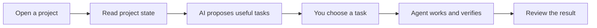

<p align="center"></p>

# ConeCode

**AI figures out what to work on. You choose what happens next.**

[简体中文](README.zh-CN.md) · English

ConeCode is a desktop AI coding workspace built with Electron, React, and TypeScript. It helps with the question that comes before a prompt: **“What should I work on?”**

Open a project and ConeCode gathers its current state: files, Git changes, TODOs, available scripts, and signs of existing tests. Ask it to find work, and your selected AI model turns that context into concrete task cards. Pick a task, adjust the direction, and let the agent work through it with the approval level you choose.



## What makes it different

- **Start with choices.** Get project-aware suggestions instead of having to invent every task yourself. Suggestions can cover unfinished work, code review, missing tests, and practical next steps.
- **You set the direction.** Suggestion generation is an explicit action; selecting a task starts work. Opening a folder alone does not authorize the model to execute suggested tasks.
- **Go from idea to project.** Explore project ideas, choose one, and use the guided workflow to scaffold, verify, and repair a new project.
- **Keep work in one place.** Chat, files, an editor, terminal sessions, change review, Git worktrees, and a web preview sit in one desktop workspace.
- **Choose your model.** Adapters support OpenAI, Anthropic, Gemini, DeepSeek, OpenRouter, and custom compatible endpoints. You supply your own provider credentials; available capabilities depend on the provider and model.
- **Control execution.** Plan mode supports research before implementation. Approval modes let you review changes and commands, auto-apply file edits, or explicitly enable full automation.
- **Continue longer tasks.** Goals, TODOs, context compaction, workspace-aware conversations, and memory help the agent keep track of ongoing work.
- **Edit the conversation.** Edit a previous user message in place, cancel without changing history, or submit it to replace that turn and regenerate from there.
- **Extend the workspace.** Add skills and MCP tools. Optional computer-control and phone-access features are available when explicitly configured.
- **Use your preferred interface.** English, Simplified Chinese, and Japanese UI translations; light, dark, and system themes.

## Try the workflow

1. Add a provider and select a model in Settings.
2. Open a project folder. ConeCode reads basic workspace facts locally.
3. Choose **Find work** to request AI-generated suggestions.
4. Pick a task card, or type your own request. You can also start from a new-project idea.
5. Review proposed changes and commands under the default approval mode.
6. Inspect the result, run checks, and choose the next task.

AI recommendations and verification are best-effort. Read the proposed task and check the resulting changes; a passing command is not a guarantee of correctness.

## Run from source

Use **Node.js 24** (recommended; minimum 22.12), npm, and Git. Development is primarily exercised on macOS. Windows packaging is configured, but platform-specific features differ.

```bash
npm ci
npm run dev
```

`npm run dev` starts Vite and Electron. To run a production build locally:

```bash
npm run build
npm start
```

The repository does not contain API keys, signing certificates, application data, or prebuilt installers. Configure your own provider in the application.

## Checks

```bash
npm run typecheck
npm test
npm run build
npm audit
```

Some tests create temporary loopback servers. macOS-specific sandbox tests require macOS; other platforms skip those checks.

## Packaging and optional tunnels

```bash
npm run dist        # macOS package
npm run dist:win    # Windows x64 package
```

Packaging requires the normal Electron Builder tools for the target platform. Signing and notarization need your own credentials; no signing material is included.

Cloudflared is optional at runtime and is **not committed to this repository**. The packaging configuration expects these files when bundling tunnel support:

- macOS Apple Silicon: `resources/bin/cloudflared-darwin-arm64`
- Windows x64: `resources/bin/cloudflared-win-x64.exe`

Obtain the matching binary from the [official Cloudflare releases](https://github.com/cloudflare/cloudflared/releases). Alternatively, omit the corresponding `extraResources` entry when building without a bundled tunnel. The application can also use a separately installed tunnel tool.

## Privacy and execution boundaries

- Conversations and settings live in Electron's local application-data directory. **Provider credentials are currently stored in local JSON, not an OS credential vault.** Protect that directory and do not share it.
- Model requests can include selected project context. Optional learned memory can issue additional requests to your configured provider. This is not an offline-only application; provider retention and billing policies apply.
- The default mode asks before edits and commands. Full-auto mode, custom skills, MCP servers, computer control, and remote access can act with significant local authority. Enable them only for tasks and tools you trust.
- The command write sandbox uses macOS Seatbelt. Do not assume equivalent OS sandboxing on Windows or other systems, or that every application feature is covered by it.
- Editing a past message removes its later transcript, **not file changes or external effects already performed**. File/checkpoint undo is a separate operation; commands and external actions may be irreversible.
- Remote TLS keys are generated separately for each installation and stored locally. Older phone clients that pin the former shared certificate need to be updated or paired with the new installation identity. Self-signed certificates are not automatically trusted by browsers. Keep remote access off unless you need it, and treat pairing URLs as credentials.

## Project layout

```text
electron/             Desktop process, IPC, preview, remote and computer control
src/components/       Chat and workspace UI
src/stores/           Agent loop, task suggestions, goals, models and settings
src/core/agenda/      Project analysis and task/idea generation
src/core/providers/   Provider adapters
src/core/tools/       Agent tool definitions
src/core/storage/     Local persistence
preview/              Isolated UI development fixtures
```

## Contributing

Describe the problem and expected behavior, keep changes focused, and run the relevant checks. Never include credentials, pairing links, private logs, or personal project data in issues or pull requests. For a security concern, avoid posting exploit details or secrets in a public issue; use GitHub's private vulnerability reporting if the repository offers it.

**License:** no open-source license has been selected yet. Public source availability alone does not grant a general license to redistribute or modify the software.
