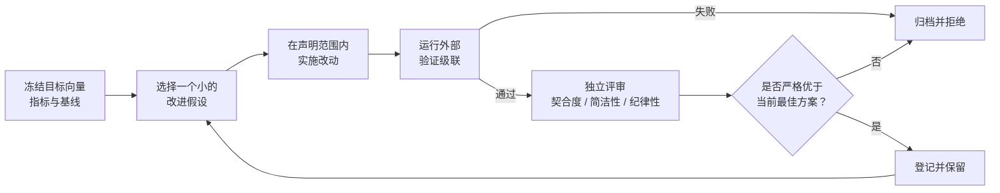
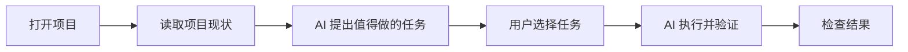

<p align="center"></p>

# ConeCode

**AI 自己思考可以做什么，用户来选择下一步。**

简体中文 · [English](README.md)

ConeCode 是基于 Electron、React 和 TypeScript 的桌面 AI 编程工作台。它从写提示词之前的问题开始：**“我接下来应该做什么？”**

打开一个项目，ConeCode 会读取文件、Git 改动、TODO、可用脚本和测试线索。点击“寻找任务”后，你选择的 AI 模型会根据项目现状提出具体的任务卡片。你挑选任务、调整方向，再让 AI 按设定的审批方式执行。

## RSI：以可验证的方式持续改进软件

ConeCode 的 **RSI（递归自我改进）模式**不只是“让 AI 再试一次”。它面向持续、可衡量的改进任务：让测试更可靠、清除类型错误、改善完成质量、缩短可测的耗时，或把一个产品能力真正打磨到可用。

它不是无限制的自我修改。Agent 只能在当前工作区提出和实施小步候选改动；成功标准、验证命令和安全边界都固定在 Agent 自己的判断之外。



### 这个循环为什么可控

- **外部裁判，不靠自我打分。** 首轮前会在 `.conecode/rsi/GOAL_VECTOR.md` 固化目标、2–5 个指标、精确命令、基线和非目标；“看起来更好”不是成功证据。
- **硬验证门槛。** 类型检查、局部测试、完整测试和冻结指标按成本从低到高执行。任何必要条件失败即为硬失败，评审不能把红灯变绿灯。
- **每轮只改一个模块。** 候选改动只能覆盖 `loop`、`tools`、`observation`、`context`、`completion` 或 `product` 中的一项，便于归因、审查和回滚。
- **改进要支付复杂度成本。** 外部指标的提升占主导；契合度、简洁性和纪律性评审只在已通过硬验证的候选中排序，过大的改动会被扣分。
- **保留谱系而非只记胜者。** 通过验证但暂未胜出的候选也会保留其指标、证据和父节点；后续可以重访优秀但探索不足的分支，而非盲目沿一条路径爬坡。
- **发现快、登记慢。** 只有跨过证据门槛的经验、技能或工作流调整才可进入持久记录，避免一次偶然成功污染后续行为。
- **会停下来。** 到达平台期、连续硬失败、下一步不安全或越界时停止，不会为了消耗预算制造无意义改动。

RSI 不得为了跑分削弱审批、沙箱、认证、TLS、权限或测试；不得修改工作区外内容、暗中改变指标、强制推送、部署、发布或扩张自身权限。它是受约束、可审计的软件改进回路，而非“开放式无限进化”。

### 如何使用

1. 在 Agent 模式菜单选择 **RSI**，或输入 `/mode rsi`。
2. 提出可衡量的结果，例如“在不弱化测试的前提下清零类型错误”。
3. 首轮前确认章程、指标、验证命令和非目标。
4. 在 `.conecode/rsi/` 查看目标向量、迭代记录、谱系、反思、发现树和 `EVOLUTION_LOG.md`。

一次性任务适合 Standard 模式；长期、可衡量的交付适合 Goal 模式；可拆分的独立分析适合 Orchestrate 模式。只有“持续、可测的改进”本身就是任务时，才应使用 RSI。



## 软件特色

- **从选择开始。** AI 根据项目提出后续工作，例如继续未完成任务、审查改动、补充测试，让你不必每次都从空白输入框开始。
- **方向由你决定。** 点击后才请求 AI 生成建议，选中任务后才开始执行；仅打开文件夹不会授权 AI 自动执行建议。
- **从创意到项目。** 浏览项目创意、选择方向，通过引导流程创建项目、运行验证并尝试修复问题。
- **一个完整工作台。** 对话、文件树、编辑器、终端、改动审查、Git 工作树和网页预览放在同一个桌面窗口里。
- **模型自由选择。** 支持 OpenAI、Anthropic、Gemini、DeepSeek、OpenRouter 和自定义兼容端点。自行配置服务商凭据，具体能力取决于模型和端点。
- **执行过程可控。** 计划模式用于先研究再实施；可以逐项审批、自动应用文件编辑，或主动开启全自动执行。
- **支持持续工作。** 目标、TODO、上下文压缩、项目关联对话和记忆帮助 AI 跟进较长的任务。
- **对话回退编辑。** 在原位置编辑历史用户消息；取消保留原对话，发送后替换该轮并从这里重新生成回复。
- **可以扩展。** 支持自定义 Skills 和 MCP 工具；按需配置电脑控制及手机远程访问。
- **多语言与主题。** 提供中文、英文、日文界面，以及浅色、深色和跟随系统的主题。

## 使用流程

1. 在设置里添加服务商并选择模型。
2. 打开项目文件夹，ConeCode 在本地读取基本项目状态。
3. 点击“寻找任务”，让 AI 生成建议。
4. 选择任务卡片，或直接输入自己的需求；也可以从一个新项目创意开始。
5. 在默认审批模式下检查 AI 提出的编辑和命令。
6. 查看结果、运行检查，再决定下一步。

AI 建议和验证结果仍需要人工判断。请阅读任务内容并检查实际改动；某条命令运行成功不代表结果一定正确。

## 从源码运行

推荐 **Node.js 24**，最低要求 22.12，并准备 npm 和 Git。目前主要在 macOS 开发和验证；仓库配置了 Windows 打包，但部分能力存在平台差异。

```bash
npm ci
npm run dev
```

`npm run dev` 会启动 Vite 和 Electron。运行生产构建：

```bash
npm run build
npm start
```

仓库不包含 API 密钥、签名证书、应用数据或预构建安装包。请在软件内配置自己的服务商。

## 检查命令

```bash
npm run typecheck
npm test
npm run build
npm audit
```

部分测试需要启动本机回环服务器。macOS 沙箱测试只在 macOS 上运行，其他平台会跳过。

## 打包与可选的远程隧道

```bash
npm run dist        # macOS 安装包
npm run dist:win    # Windows x64 安装包
```

打包需要 Electron Builder 对应平台的工具。签名和公证需要自己的凭据，仓库不会携带签名材料。

Cloudflared 是可选的运行时工具，**二进制文件不提交到仓库**。需要捆绑隧道功能时，现有打包配置会寻找：

- macOS Apple Silicon：`resources/bin/cloudflared-darwin-arm64`
- Windows x64：`resources/bin/cloudflared-win-x64.exe`

请从 [Cloudflare 官方发布页](https://github.com/cloudflare/cloudflared/releases) 获取对应文件。不捆绑隧道时，可移除相应的 `extraResources` 配置。应用也支持使用单独安装的隧道工具。

## 隐私与执行边界

- 对话和设置保存在 Electron 本地应用数据目录。**服务商凭据目前保存在本地 JSON 中，尚未使用系统凭据保险库。** 请保护这个目录，不要将其分享或上传。
- 调用模型时可能发送选定的项目上下文；可选的学习记忆功能也可能向所配置的服务商发起额外请求。软件并非完全离线，数据保留和计费遵循对应服务商政策。
- 默认模式会审批编辑和命令。全自动模式、自定义 Skills、MCP 服务、电脑控制和远程访问具有较大的本机操作权限，请仅在信任相关任务和工具时启用。
- 命令写入沙箱基于 macOS Seatbelt。不要假定 Windows 等平台具有同等系统隔离，也不要假定所有功能都受该沙箱约束。
- 回退编辑会删除后续对话，**不会撤销已经发生的文件修改或外部操作**。文件及检查点撤销是单独的功能；命令和外部操作可能无法回滚。
- 远程 TLS 密钥在每次安装中独立生成并保存在本机。固定信任旧共享证书的手机客户端需要更新或重新配对当前安装的证书；浏览器不会自动信任自签名证书。不需要远程访问时请保持关闭，并将配对链接视为凭据保护。

## 代码结构

```text
electron/             桌面主进程、IPC、预览、远程及电脑控制
src/components/       对话和工作台界面
src/stores/           Agent 循环、任务建议、目标、模型和设置
src/core/agenda/      项目分析及任务、创意生成
src/core/providers/   服务商适配器
src/core/tools/       Agent 工具定义
src/core/storage/     本地持久化
preview/              独立 UI 开发示例
```

## 参与改进

请描述问题和预期行为，保持改动聚焦，并运行相关检查。不要在 Issue 或 PR 中包含密钥、配对链接、私人日志或个人项目数据。发现安全问题时，不要公开提交利用细节或敏感信息；如果仓库提供 GitHub 私密漏洞报告入口，请优先使用。

**许可证：** [MIT](LICENSE) — 可自由使用、修改与再分发，需保留版权声明。
